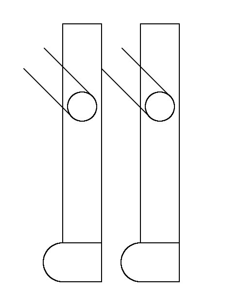

元气打腿版规则 

Rules for the Power Violence Edition

规则版本: 0.0.19 
Rule version: 0.0.19 
 
规则撰写日期: 2026年3月29日 
Date of rule writing: March 29, 2026 

文件大小: 83 KB

# 元气打腿版规则 Rules for the Power Violence Edition

## 目录

1. 打腿版规则介绍 Introduction to PV
   1. 打腿版基本原则 PV Basic principle
   2. 打腿版更新方式及要求 Update methods and requirements for the PV
   3. 打腿版规则表述 The description of the PV rules
2. 打腿版玩法 The gameplay of the PV
   1. 概念定义 Concepts
   2. 状态定义 States
   3. 召唤物 Scapegoat
   4. 限制 Limits
   5. 技能类别 Skill Categories
   6. 技能名称和分类 Skill Name and Classification
   7. 技能定义 Skills
   8. 预备技能定义 Preparatory Skills
   9. 判断流程 Judgment process
   10. 其他规定 Other Regulations
3. 底层实现 Underlying Layer
   1. 底层概念 Underlying Layer's Concepts
   2. 打腿版一人信息储存方式 Storage Method
   3. 玩家-玩家储存器 Player-Player Storage
   4. 打腿版数据类型 Data Type
   5. 关于计算的详细说明 Detailed explanation of the calculation
4. 更新公告 Annoucements
   1.  元气打腿版 0.0.0  更新公告  Power Violence Edition 0.0.0  annoucement
   2.  元气打腿版 0.0.1  更新公告  Power Violence Edition 0.0.1  annoucement
   3.  元气打腿版 0.0.2  更新公告  Power Violence Edition 0.0.2  annoucement
   4.  元气打腿版 0.0.3  更新公告  Power Violence Edition 0.0.3  annoucement
   5.  元气打腿版 0.0.4  更新公告  Power Violence Edition 0.0.4  annoucement
   6.  元气打腿版 0.0.5  更新公告  Power Violence Edition 0.0.5  annoucement
   7.  元气打腿版 0.0.6  更新公告  Power Violence Edition 0.0.6  annoucement
   8.  元气打腿版 0.0.7  更新公告  Power Violence Edition 0.0.7  annoucement
   9.  元气打腿版 0.0.8  更新公告  Power Violence Edition 0.0.8  annoucement
   10. 元气打腿版 0.0.9  更新公告  Power Violence Edition 0.0.9  annoucement
   11. 元气打腿版 0.0.10 更新公告  Power Violence Edition 0.0.10 annoucement
   12. 元气打腿版 0.0.11 更新公告  Power Violence Edition 0.0.11 annoucement
   13. 元气打腿版 0.0.12 更新公告  Power Violence Edition 0.0.12 annoucement 
   14. 元气打腿版 0.0.13 更新公告  Power Violence Edition 0.0.13 annoucement 
   15. 元气打腿版 0.0.14 更新公告  Power Violence Edition 0.0.14 annoucement
   16. 元气打腿版 0.0.15 更新公告  Power Violence Edition 0.0.15 annoucement
   17. 元气打腿版 0.0.16 更新公告  Power Violence Edition 0.0.16 annoucement
   18. 元气打腿版 0.0.17 更新公告  Power Violence Edition 0.0.17 annoucement
   19. 元气打腿版 0.0.18 更新公告  Power Violence Edition 0.0.18 annoucement
   20. 元气打腿版 0.0.19 更新公告  Power Violence Edition 0.0.19 annoucement
5. 关于本规则的意见和建议 Comment section

## 打腿版规则介绍 Introduction to PV
### 打腿版基本原则 PV Basic principle
1. 元气打腿版为纯运气游戏。即若1人对阵n人时, 无论n个人出什么技能, 必须存在至少一种方案保证**该人**在有限回合内取得胜利。PV(Power Violence Edition) is purely a game of chance. That is, when one person faces n people, regardless of the skills each person uses and the value of n, there must exist at least one solution to ensure victory **of this player** within a limited number of rounds.
2. 元气打腿版应当具有可以完美解释所有可能发生情况的规则。该规则不能让玩家享有特权。该规则应是完备的, 具有严谨性。PV should have rules that can perfectly explain all possible scenarios. These rules should not give players privileges. The rules should be complete and rigorous.
3. 元气打腿版的表层与底层相互兼容。表层概念能够在底层中被实现, 被称为可实现性。The surface and the underlying layer of PV are compatible. The surface concepts can be realized in the underlying layer, which is called feasibility.
4. 元气打腿版的表层应当易于玩家操作, 这被称为可操作性。The surface of PV should be easy for players to operate, which is called operability.
5. 打腿版要求可拓展性, 尽可能地兼容其他版本。可拓展性也包括灵活性, 即不能过于死板导致新增加技能遭到巨大限制。 PV requires scalability and compatibility with other editions as much as possible. Scalability also includes flexibility, meaning it should not be too rigid to cause significant restrictions on the addition of new skills.
6. 元气打腿版的底层应当较为稳定, 避免大范围改动。The underlying layer of PV should be relatively stable and avoid major changes.
7. 元气打腿版要求玩家小于256人且为自然数, 若超出此限制, 则规则不适用。PV requires that the number of players be less than 256 and be a natural number. If the number of players exceeds this limit, the rules will not apply.
8. 可实现性(feasibility), 严谨性(rigor) > 可操作性(operability) > 可拓展性(scalability).
9. 元气打腿版的规则经投票产生。投票者为 _6_ 和 _负七影_。The rules for PV are determined through a vote. The voters are _Jingxuan_ and _Jerry_.
10. 对于打腿版的底层实现, 除非会严重影响游戏会增加新技能, 无需向玩家透露。For the underlying layer of PV, unless it would significantly affect the gameplay and require the addition of new skills, there is no need to inform the players.
---
---
### 打腿版更新方式及要求 Update methods and requirements for the PV
提案 Proposals:
1. 内容需具备**可实现性**, **可操作性**, **严谨性**, **可拓展性**。The content should feature **feasibility**, **operability**, **rigor**, **scalability**.
2. 用词准确, 不自相矛盾。The wording should be accurate and free from contradictions.
3. 要结合事实, 新创造的东西要定义。It should be based on facts, and new creations should be defined.
4. 需明确记载撰写日期和投票结果及日期。The date of writing, the voting result, and the date of the voting should be clearly recorded.
---
投票制度 Voting system:
* 提案可以由任何人撰写(被剥夺提案权的人除外) The proposal can be written by anyone (except those deprived of the right to propose).
* 对于投票, 有投票权者可进行投票, 按照票权计算结果。6和31的票权均为2。暂时不接受其他人加入投票者名单。For voting, those with voting rights can vote, and the result will be calculated based on the voting rights. The voting rights of *Jingxuan* and *Jerry* are both 2. Currently, no one else is allowed to join the voting list.
* 在打腿版中, 6和负七影应分工明确。6主管底层, 负七影主管表层。In PV, *Jingxuan* and the *Jerry* should have clear divisions of labor. *Jingxuan* is in charge of the lower layer, and the *Jerry* is in charge of the upper layer.
* 投票可投 Voting can be:
   1. 同意 / Approved / ✓: 表示同意, 计为1 indicating agreement, and is counted as 1.
   2. 不同意 / 反对 / Disapproved / ×: 表示反对, 计为-1 indicating opposition, and is counted as -1
   3. 弃权 / 弃 / Abstention: 表示弃权, 计为0 indicating abstention, and is counted as 0
   4. 拒投 / RTV / Refuse to vote: 表示拒投(需说明理由) indicating refusal to vote (reasons need to be explained)
   * 若未按上述要求进行投票, 视为同意。If voting is not conducted according to the above requirements, it is considered as agreement.
* 投票中存在4个角度: 可实现性, 可操作性, 严谨性, 可拓展性。6主管可实现性和可拓展性, 负七影主管可操作性和严谨性。若某一角度存在问题则可拒投, 否则不可以。若投票被拒投, 则无法通过。其余计数的加权和若大于0则视为通过, 否则视为不通过。通过的提案应尽快撰写更新公告, 否则视作此提案无效。There are 4 aspects in the voting: **feasibility**, **operability**, **rigor**, and **scalability**. *Jingxuan* is in charge of feasibility and scalability, and *Jerry* is in charge of operability and rigor. If there is a problem in any aspect, one can refuse to vote, otherwise, it is not allowed. If the voting is refused, it cannot be passed. The weighted sum of the remaining counts if greater than 0 is considered passed, otherwise, it is considered not passed. The updated announcement for the passed proposal should be written as soon as possible. Otherwise, this proposal is considered invalid.
  > 示例 Example:˙
  > | 6        | 31       | result   |
  > |:--------:|:--------:|:--------:|
  > | Approved | Approved | approved |
---
更新公告 Update announcements:
* 对于更新公告, 必须完整体现通过提案内容。更新公告要包含投票结果、撰写时间、版本号。For the update announcement, the content of the approved proposal must be fully reflected. The update announcement should include the voting result, the writing time, and the version number.
---
打腿版规则 PV rules:
* 打腿版设立独立完备的规则, 规则内容严格按照更新公告进行。PV has established independent and complete rules, and the content of these rules strictly follows the updated announcements.
---
---
### 打腿版规则表述 The description of the PV rules
大小比较 How to compare sizes:
1. 打腿版的大于和小于均只比较实数部分(*real part*)。等于会同时比较实数部分和虚数部分(*imaginary part*)。
   > 例如A与B作比较, 若$\Re(A)>\Re(B)$, 则称$A>B$; 若$\Re(A)<\Re(B)$, 则称$A<B$; 若$\Re(A)=\Re(B)$且$\Im(A)=\Im(B)$, 则$A=B$。
2. 打腿版中的大于等于($\geq$)指大于或等于, 小于等于($\leq$)指小于或等于。
3. 打腿版中的不小于($\not<$)、不大于($\not>$)、不等于($\neq$)得到的结果分别与小于、大于、等于相反。即: 若$A<B$为False, 则$A\not<B$为True。
   > 注意: 打腿版的不小于和大于等于意思不相同。
4. 若范围不同的类型比较大小, 则自动升为范围更大的类型作比较。
5. $\max(...)$:
   * 表示在很多数中取最大值。先比较实数部分, 再比较虚数部分。
   * 即: $如果\exists r\in\Complex, \forall a_i(i=1, 2, ..., n)\in\Complex, \Re(a_i)\leq\Re(r), 且\forall a_i(i=1, 2, ..., n, \Re(a_i)=\Re(r)), \Im(a_i)\leq\Im(r), 且\exists a_i = r, 则max(a_1, a_2, ..., a_n) = r$。
6. $\min(...)$:
   * 表示在很多数中取最小值。先比较实数部分, 再比较虚数部分。
---
特殊表述 Special expression:
1. 简称应当大写, 最好加粗或添加下划线。
   > **这是加粗文本**
   > <u>这是下划线文本</u>
2. 同时斜体下划表示底层实现。查看规则时双线下划线一般不会造成无法理解。若有必要可查看底层实现。**底层实现不会很严谨。**
   ><u>*这是斜体下划线文本*</u>
3. 打腿版文字统一使用UTF-8编码。
4. 对于打腿版的底层设计, 除非会严重影响游戏会增加新技能, 无需向玩家透露。
5. *31*、*负七影*、*Jerry*是同一个人。*6*、*Jingxuan*是同一个人。
6. 状态、召唤物也属于一种概念，为防止重复，不在**概念定义**中定义，而是在其自己章节中进行定义。
---
词语解释 Explanation of words:
1. 增加: 指某个数值在某一时间点大于在其之前的另一时间点。
2. 减少: 指某个数值在某一时间点小于在其之前的另一时间点。
3. 指令扣命: 指该伤害无法被防御, (但可以被加命所抵消)。
4. 防: 指对方技能对自己无效。
5. 无敌: 指可以防所有技能。但指令扣命不可防, 特殊规定破无敌的技能不可防。技能若未说是否破无敌, 则认为其不破。

## 打腿版玩法 The gameplay of the PV
### 概念定义 Concepts
1. 伤害(*Harm*):
   * 指一回合内或一段时间内扣的命数。在一回合内的扣命基于伤害实现。
   * 扣命可以有不同的抵法, 不同抵法的扣命应当分开计算。
   * 造成n的扣命等同于造成n的伤害, 使某人命数加n等同于对该人造成-n的伤害。
   * 伤害由以下部分组成: 造成者(1B), 受伤害者(1B), 伤害类型(2B), 伤害数值(16B), 造成伤害的技能(2B)。
   * 伤害具有指向性。伤害在伤害表中存储, 在抵伤环节计算。
   * 伤害数值范围同命数范围。
2. 出错(*Using the Wrong Skills, **abbr. UWS***):
   * 有下列两种情况之一的, 视作出错。
      1. 使用规则未规定的技能(Using undefined skills)。
      2. 使用未满足使用条件的技能(Using skills that do not meet the usage conditions)。
   * 出错应当视为当回合什么也没出, 且放弃游戏。
   > 放弃游戏: 即刻进入死亡状态。
3. 地板(*floor*):
   * 也叫“场景”。
   * 不可对其造成影响, 不会被添加状态。
   * 可作为具有指向性的技能的目标。
   * 不可行动, 不具有攻击能力。
   * <u>*底层实现上是0号玩家。*</u>
4. 玩家:
   1. 表面上看, 凡参与游戏拥有编号的均可视为玩家。狭义上讲, 玩家应该为人类。
   2. 玩家的名字:
      1. 玩家不可以在游戏中途改名。
      2. 玩家的名字为必须, 初始默认为该玩家编号, 且名字不可重复。名字不能是纯数字字符串, 且不能为“地板”“场景”“floor”。
      3. 玩家的名字和计算过程无关。 
   3. 玩家的分组:
      1. 初始时, 每位玩家可以选择自己的组别。
      2. 玩家的组别应当在第0回合开始前确定完毕。
      3. 玩家在游戏途中可以加入一个已有组内, 也可以自成一组。
      4. 玩家在游戏途中可以更改自己的组别。
      5. 若一局游戏中每个玩家的组别均为自己编号, 则称其为非分组模式, 否则称之为分组模式。
5. 技能:
   1. 一个技能必须拥有编号、名称、动作、效果和性质。
   2. 每位玩家一回合只能主动使用一个技能。
   3.  一个技能最多可以有30个指向对象, 分别为:
      - 第一指向对象(the $1^{st}$ target)
      - 第二指向对象(the $2^{nd}$ target)
      - 第三指向对象(the $3^{rd}$ target)
      - 第四指向对象(the $4^{th}$ target)
      - ...
      - 第三十指向对象(the $30^{th}$ target)
6. 预备技能:
   1. 预备技能组:
      * 每个组有一个编号, 不可变, 为$(0,2^{10})$中的自然数。有和技能类似的4个名称。
      * 每个组包含一系列技能。
      * 每个组有一个标记, 为是否正式加入, 若加入则在普通技能中编号, 但不改变或删除在预备技能表中的位置。
   2. 每个技能规定和正常技能一样。预备技能组在规则中列表。需提案加入。
7. 获胜者:
   1. 当游戏结束时, 若仍幸存1位玩家, 则该名玩家为获胜者。
   2. 当游戏结束时, 若无玩家, 视为平局, 则不存在获胜者。
   3. 若为组队制, 则场上的人均为同一条队伍的成员, 则该队全员为获胜者。
   * 以上内容不考虑地板。
8.  游戏模式:
   1. 在游戏开始前, 应当确定游戏模式。
   2. 有以下游戏模式可以选择:
      * 普通模式(Normal Mode): 同组玩家无特殊效果。
      * 组队模式(Team Formation Mode): 同组玩家之间造成的伤害无效。
      * 禁止攻击队友(Friendly Mode): 对同组玩家使用指向性攻击技能视为出错。
      * ...
      > 上述“同组玩家”不包括自己。默认为普通模式。
---
---
### 状态定义 States
基本说明:
* 每个主状态都有自己的编号, 为$(0,2^{13})$内的正整数。
* 每个状态有中文名、英文名。中文名和英文名类型均为名称字符串类型。
* 每个状态可以有127个以内的子状态。每个子状态有一个编号, 为$(0,128)$内的正整数。
* 每个状态可以有127个以内的子数据。每个子数据类型不限。每个子数据有一个编号, 为$(0,128)$内的正整数。
* 目前状态有:
  * | Serial Number | English name       | Chinese name |
    |--------------:|:------------------:|:------------:|
    | 1             | Initial State      | 初始状态      |
    | 2             | State of Death     | 死亡状态      |
    | 3             | State of Scapegoat | 召唤物状态    |
    | 4             | State of Reality   | 本体状态      |
定义:
1. 初始状态:
   * 指第0回合玩家的正常状态, 一般为零元气, 两条命, 命数上限10, 无特殊状态。
2. 死亡状态:
   1. 若玩家命数 $\leq 0$, 则进入该状态。
   2. 在进入该状态时会丢失之前的所有状态。
   3. 在该状态下无法使用技能。在改装下自身的数据不能被进行任何修改(除非增加新的玩家)。
   4. 地板将永远保持该状态。
4. 本体状态:
   1. 若玩家不处于召唤物状态, 则处于本体状态。
---
---
### 召唤物 Scapegoat
* 指可以实现把本体的元气数、命数、命数上限等封存, 使用召唤物的储存。召唤物解除之后, 启用原来的元气数、命数、命数上限等。
* 对于召唤物而言, 元气数指召唤物1位储存的数, 命数指召唤物2位储存的数, 命数上限指召唤物3位储存的数。
* 每个召唤物有一个编号, 为$(0,2^{13})$内的正整数。若玩家不处于召唤物状态, 则处于本体状态。
* 底层实现: 本体为0号召唤物。
---
---
基本说明:
* 指可以实现把本体的元气数、命数、命数上限等封存, 使用召唤物的储存。召唤物解除之后, 启用原来的元气数、命数、命数上限等。
* 对于召唤物而言, 元气数指召唤物1位储存的数, 命数指召唤物2位储存的数, 命数上限指召唤物3位储存的数。
* 每个召唤物有一个编号, 为$(0,2^{13})$内的正整数。若玩家不处于召唤物状态, 则处于本体状态。
* 底层实现: 本体为0号召唤物。
---
---
### 限制 Limits
1. 元气(*power number*)实数部分范围: $[-2^{119},2^{119})$, 精度: $2^{-8}$, 虚数部分同理。
2. 命数(*lives number*)实数部分范围: $[-2^{59},2^{59})$, 精度: $2^{-4}$, 虚数部分同理。
3. 命数实际上限(*(actual) upper limit of lives*)范围同命数范围。
4. 伤害(*harm*)范围与命数范围相同, 但通常包含额外信息, 如造成方, 被造成方, 特殊性质等。
5. 对于召唤物(scapegoat)而言:
   * 所有召唤物拥有6个位置储存:
      1. **召唤物1位**对应元气, 范围同元气。
      2. **召唤物2位**对应命数, 范围同命数。
      3. **召唤物3位**对应命数实际上限, 范围同命数实际上限。
      4. **召唤物4位**和**召唤物5位**自行安排, 占空间大小为32B。
      5. **召唤物6位**也被称为**巨大整数存储位置**, 自行安排, 占空间大小为64B。
   * 召唤物拥有状态有64B的空间储存。
6. 名称不得大于等于128字节。
7. 技能数范围: $(0,2^{13})$
8. 玩家数 $\{0,1,2,3,\cdots,255\}$
9.  技能数 $\{1,2,3,\cdots,2^{13}\}$
10. 名称字节数 $\in\N^*$
11. 状态数 $\in\N$
12. 回合数默认会小于最多玩家数的平方, 即 $回合数<(2^8-1)^2=65025$。
---
---
### 技能类别 Skill Categories
按照用处来分 According to their functions:
1. 攻击技能(*Attack Skill, **abbr. AS***):
   * 可以对初始状态下的出元气者<u>*和出**NUS***</u>者造成伤害的技能。
2. 增加元气技能(*Increase Power Skill, **abbr. IPS***):
   * 初始状态下若所有人均出该技能(不考虑出错)会让所有人元气数总和增加**且**不为攻击技能的技能。
3. 防御技能(*Defence Skill, **abbr. DS***):
   * 初始状态下, 若有人对自己出某攻击技能(不考虑出错)且自己出该技能(不考虑出错)不会导致扣命**且**不为攻击技能或增加元气技能的技能。
4. 其他技能(*Other Skill, **abbr. OS***):
   * 不属于上述3个类别的技能。
---
按照指向来分 According to the direction:
1. 非指向性技能(*Non-restricted Skill, **abbr. NS***):
   + 其第一指向对象~第三十指向对象必须为0(floor)。
   + 对于**NS**来说, 不可说指向某一玩家。表面上看, 该类型技能没有指向对象。
2. 单指向性技能(*Single Restricted Skill, **abbr. SRS***):
   + 其第二指向对象~第三十指向对象必须为0(floor); 其第一指向对象可为0也可不为。
   + 对于**SRS**来说, 指向某一玩家取决于第一指向对象。表面上看, 该类型技能只有一个指向对象。
3. 第二指向对象(*Dual Restricted Skill, **abbr. DRS***):
   + 其第三指向对象~第三十指向对象必须为0; 其第一指向对象、第二指向对象可为0也可不为。
   + 对于**DRS**来说, 指向某一或二位玩家取决于第一指向对象和第二指向对象。表面上看, 该类型技能只有两个指向对象。
4. 第三指向对象(*Triple Restricted Skill, **abbr. TRS***):
   + 其第四指向对象~第三十指向对象必须为0; 其第一指向对象~第三指向对象可为0也可不为。
   + 对于**TRS**来说, 指向某一或二或三位玩家取决于第一指向对象、第二指向对象和第三指向对象。表面上看, 该类型技能只有三个指向对象。
5. 四指向性技能(*Quadruple Restricted Skill, **abbr. QRS***):
   + 其第五指向对象~第三十指向对象必须为0; 其第一指向对象~第四指向对象可为0也可不为。
   + 对于**QRS**来说, 指向某一或二或三或四位玩家取决于第一指向对象、第二指向对象、第三指向对象和第四指向对象。表面上看, 该类型技能只有四个指向对象。
6. 更多指向性技能:
   + 对于n指向性技能($n \in\lbrace 1,2,3,...,30\rbrace$), 其第m指向对象($n<m\leq 30,m\in\Z$)必须为0; 其第k指向对象($0<k\leq n, k\in\Z$)可为0也可不为。
   + 对于n指向性技能($n \in\lbrace 1,2,3,...,30\rbrace$)来说, 指向某m($0\leq m\leq n, m\in\Z$)位玩家取决于前m个指向对象。表面上看, 该类型技能只有n个指向对象。
* 指向数(*Targeted Objects' Number, **abbr. TON***):
   * 指一个技能可以指向的玩家的最大个数。
   * 对于每一个技能, 都有唯一的**TON**, 为小于等于30的自然数。
   * **TON**是技能的第二个属性。
   > **TON**为**0**即**NS**, **TON**为**1**即**SRS**, **TON**为**2**即**DRS**, **TON**为**3**即**TRS**, **TON**为**4**即**QRS**
---
---
### 技能名称和分类 Skill Name and Classification
| Serial Number | English name     | Attributes  | Abbreviation | Chinese name | Alias |
|--------------:|:----------------:|:-----------:|:------------:|:------------:|:-----------------:|
|<u>*0*</u> |<u>*not using skills*</u> |<u>*OS, 0*</u> |<u>*NUS*</u> |<u>*什么也没出*</u> |                  |
| 1             | break one's leg  | AS, 1      | BOG          | 打断双腿       | 注意看,这位玩家只是出了一个平平无奇的技能,就被它恶毒的对手活活打断了双腿,从此下身瘫痪 |
| 2             | power            | IPS, 0     | P            | 元气          | 抛瓦              |
---
---
### 技能定义 Skills
1. 打断双腿
   * 动作: 双手握实心拳,分别向指向目标的大腿中部快速反复做锤击动作。若对方没有大腿, 也可以向指向目标的其他部位快速反复做锤击动作。做该动作时, 双手手肘均不能位于肩膀上方。Make a fist with both hands and quickly repeat the hammering motion towards the middle of the target's thigh. If the opponent doesn't have a thigh, you can also perform the hammering motion towards other parts of the target quickly and repeatedly. During this action, the elbows of both hands must not be above the shoulders.
   * 效果: 当回合被执行人命数减$\max(\frac{被执行者命数}{2}, 1)$, 元气乘二。若1回合被打断n次腿则减$\max(\frac{2^n-1}{2^n}被执行者命数, n)$, 元气乘$2^n$。若执行者非对自己且被执行者对自己使用打断双腿, 则执行者被打断双腿, 被执行者不被打断双腿。 When the number of the executing party decreases by $\max\left(\frac{\text{lives}}{2}, 1\right)$ in a round, the power doubles. If the execution is interrupted n times in one round, then the number of executing party is reduced by $\max\left(\frac{2^n - 1}{2^n}\text{lives}, n\right)$, and the power is multiplied by $2^n$. If the executing party is not against itself and the executed party is against itself in the case of interrupting the legs, then the executing party is interrupted in the legs, but the executed party is not.
2. 元气
   * 动作: 双手置于身前, 一手手背朝上, 一手手背朝下。双手五指并拢, 食指、中指、无名指和小拇指弯曲。手背朝上的手的重心位于手背朝下的手的重心上方。双手手指内侧应分别接触(大拇指除外)。双手手臂内侧与手掌的夹角不得小于90°且不得大于270°(取主值), 手指背面(大拇指除外)与另一手的手掌内侧相接处。 Place both hands in front of your body, with one hand palm facing upwards and the other palm facing downwards. Keep all fingers of both hands together, with the index finger, middle finger, ring finger and little finger bent. The center of gravity of the hand with the palm facing upwards should be above the center of gravity of the hand with the palm facing downwards. The inner sides of the fingers of both hands should touch (except for the thumb). The angle between the inner sides of the arms and the palms should not be less than 90° and not more than 270° (taking the value between 0° and 360°), and the back of the fingers (except for the thumb) should be connected to the inner side of the palm of the other hand. 
   * 效果: 使自己元气+1 Boost your power by 1 point.
---
---
### 预备技能定义 Preparatory Skills
* 目前没有预备技能 I'm very sorry, but the pre-requisite skills are not available yet.
---
---
### 判断流程 Judgment Process
* 在0回合开始前:
   1. 每位玩家可以选择自己的组别
   2. 决定游戏模式
   3. 每位玩家变为初始状态
* 每回合计算:
   1. 预处理:
      1. 判断是否有新成员加入
      2. 判定每位玩家出的技能
      3. 出错判定
   2. 计算状态加入:
   3. 主要计算:
      1. 计算增加元气
         1. 出元气者, 元气数+1
      2. 计算攻击技能
         1. 计算打腿
   4. 防御技能抵命:
   5. 结束计算
      1. 通过伤害计算每位玩家命数
      2. 命数 $\leq$ 0者进入死亡状态; 扣命>1者元气清零
      3. 若场上仅有 $\leq 1$ 名玩家命数 $\not\leq 0$, 游戏结束
* 在游戏结束后判断谁是获胜者。
---
---
### 其他规定 Other Regulations
1. 元气数超限者清零, 命数、命数上限同理。When the energy count exceeds the limit, it is reset to zero. The same applies to the fate count and its upper limit.
2. 任何一步计算都加超限判断。A super-limit check is performed in any calculation step.
3. 低于精度时向零取整(截断)。When the result is below the precision level, it is rounded down (truncated).
4. 出错扣所有命。Using the wrong skill will result in the loss of all lives.
5. 打腿版的出错判定不能依靠256回合及之前的状态或技能等。

## 底层实现 Underlying Layer

### 底层概念 Underlying Layer's Concepts
1. 什么也没出(*Not Using Skills, **abbr. NUS***):
   * 其应当被视为0号技能(zeroth skill, $0^{th}$ skill)。不能被主动使用。
2. 玩家:
   1. 底层上把地板视为玩家。
   2. 玩家的名字:
      1. 玩家的名字存储在名字列表中。
      2. 玩家的名字不得大于等于128字节。
      3. 玩家的名字是常量字符串。
      4. 玩家的名字和计算过程无关。 
   3. 玩家的分组:
      1. 在默认情况下, 每位玩家的组别为自己的编号。
      2. 地板的组别为0。
      3. 玩家组别为小于256的正整数。组别相同的玩家在同一个组里。组的编号不得超过玩家数量。
3. 技能:
   1. 每个技能:
      | 名称               | 字节数 | 存储形式 | 说明 |
      |:------------------|------:|:--------|:----|
      | 编号 Serial Number |     2 | 一般编号类型 | 必须为小于8192的自然数 |
      | 名称 Name          |   512 | 复合类型(名称字符串 * 4) | 英文名(English name), 缩写(Abbreviation), 中文名(Chinese name), 别称(Alias) |
      | 动作 Movement      |  4096 | 复合类型(其它字符串2048B * 2) | 中文和其英文翻译 |
      | 条件 Precondition  |  1024 | 二进制数据类型 | 未定义具体储存方式 |
      | 效果 Effect        | 10240 | 复合类型(其它字符串5120B * 2) | 中文和其英文翻译 |
      | 性质 Type          |   128 | 二进制数据类型 | 未定义具体储存方式 |
      | 空格 Spaces        |   382 | 其它字符串382B | 空字符串 |
      | 总计 Total         | 16002 | 复合类型 |  |
   2. 使用技能:
      | 名称    | 字节数 | 存储形式 |
      |:-------|------:|:--------|
      | 技能编号 |    2 | 一般编号类型 |
      | 指向对象 |   30 | 复合类型(玩家编号类型 * 30) |
      | 总计    |   32 | 复合类型 |
   3. 技能条件只能与以下内容有关:
      * 局内设置
      * 可查询范围内的玩家回合信息
      * PPS
4. 召唤物:
   1. 本体为0号召唤物。
---
---
### 局内设置 Game Settings
* 游戏包含下列局内设置:
   1. 玩家数量
   2. 玩家名称 
   3. 游戏模式
   4. 对局名称(type: PV_str_names)
   5. 个性化初始状态(每人均有)
      * 个性化初始状态由玩家商量决定
      * 每个人按个性化初始状态进行初始化
      * 个性化初始状态默认情况下为初始状态。
   6. 回合数
---
---
### 打腿版一人信息储存方式 Storage Method
1. 每位玩家每回合有1KiB空间储存信息。打腿版不保存256回合及之前的玩家信息。
2. 具体储存方式:
   1. player:
      * 元气数: 32 B
      * 命数: 16 B
      * 命数上限: 16 B
      * 常用变量优化: 16 B
        + 编号(1), 召唤物编号(2), 组别(1), 回合数(4), 无敌回合数(包括当回合)(4), 上回合技能(2), 上上回合技能(2)
      * 其他存储位管理(使用存的数据的编号(2)、使用期限(2)): 32 B
      * 第4位置: 16 B
      * 第5位置: 32 B
      * 第6位置: 32 B
      * 第7位置: 16 B
      * 第8位置: 16 B
      * 第9位置: 16 B
      * 第10位置: 8 B
      * 第11位置: 8 B
   2. scapegoat:
      * 召唤物状态: 64 B
         * 召唤物的状态储存由其自定义。
      * 召唤物1位: 32 B
      * 召唤物2位: 16 B
      * 召唤物3位: 16 B
      * 召唤物4位: 32 B
      * 召唤物5位: 32 B
      * 巨大整数存储位置: 64 B
   3. state: 480 B
      1. 在储存状态的区域内, 先存储状态编号, 再按该状态储存规定在接下来的字节中存储。
      2. 若储存状态的区域无法存储, 则可尝试将压缩。若仍无法存储, 则无法加入此状态。
      3. 在确保结果正确的情况下, 可以进行一些优化。
   4. skill:
      * 技能编号: 2 B
      * 指向对象编号: 30 B
---
---
### 玩家-玩家储存器 Player-Player Storage
1. 每位玩家对每位玩家会有2KiB的空间储存信息, 请妥善利用。具体储存方式为底层实现。
---
---
### 打腿版数据类型 Data Type
* 字符串类型(String type): ***PV_str***
   1. 名称字符串(Name Character Array): ***PV_str_names***
      * 占用空间: 128B
      * 可以存储128B以内的信息, 以0字符为结束标志。
      * 用作技能名、玩家名称、备用技能名称、备用技能组名称等。
   2. 其它字符串(Other Character Array): ***PV_str_others***
      * 占用空间: 视情况而定
      * 可以存储占用空间B数以内B的信息, 以0字符为结束标志。
      * 可以用作技能动作、效果等字符表述等的地方。
* 数字类型(Numeric type): ***PV_num***
   * 整数类型: ***PV_integer***
      1. 玩家编号类型(Player ID Type): ***PV_pID***
         * 占用空间: 1B。范围: $[0,2^8)$。
      2. 一般编号类型(Normal ID Type): ***PV_sID***
         * 占用空间: 2B。范围: $[0,2^{16})$。
      3. 普通回合数类型(Normal Rounds' Number Type): ***PV_nRounds***
         * 占用空间: 4B。范围: $[-2^{31},2^{31})$。
      4. 长回合数类型(Longer Rounds' Number Type): ***PV_lRounds***
         * 占用空间: 8B。范围: $[-2^{63},2^{63})$。
   * 定点数类型: ***PV_fixed***
      1. 11+4定点数类型(11+4 Fixed-Point Number Type): ***PV_11p4***
         * 占用空间: 2B。范围: $[-2^{11},2^{11})$; 精度: $2^{-4}$。
      2. 27+4定点数类型(27+4 Fixed-Point Number Type): ***PV_27p4***
         * 占用空间: 4B。范围: $[-2^{27},2^{27})$; 精度: $2^{-4}$。
      3. 57+8定点数类型(57+8 Fixed-Point Number Type): ***PV_57p8***
         * 占用空间: 8B。范围: $[-2^{57},2^{57})$; 精度: $2^{-8}$。
      4. 119+8定点数类型(119+8 Fixed-Point Number Type): ***PV_119p8***
         * 占用空间: 16B。范围: $[-2^{119},2^{119})$; 精度: $2^{-8}$。
   * 复数类型: ***PV_complex***
      1. 元气类型(Power Type): ***PV_power***; ***PV_com256***
         * 占用空间: 32B。实部: 119+8定点数类型; 虚部: 119+8定点数类型。
      2. 命数类型(Lives Type): ***PV_lives***; ***PV_com128***
         * 占用空间: 16B。实部: 57+8定点数类型; 虚部: 57+8定点数类型。
      3. 8B复数类型(64-bit complex type): ***PV_com64***
         * 占用空间: 8B。实部: 27+4定点数类型; 虚部: 27+4定点数类型。
   * 布尔类型: ***PV_bool***
      * 占用空间: 1位。
   * 激进的类型: ***PV_onum***
      1. 四元数类型(Quaternion type): ***PV_quaternion***
         * 占用空间: 64B。
         * 119+8定点数类型 * 4。
      2. 短四元数类型(Short Quaternion type): ***PV_s_quaternion***
         * 占用空间: 32B。
         * 57+8定点数类型 * 4。
      3. 八元数类型(Octonion type): ***PV_octonion***
         * 占用空间: 64B。
         * 57+8定点数类型 * 8。
      4. 巨大定点数类型(Giant fixed-point number type): ***PV_447p64***
         * 占用空间: 64B。范围: $[-2^{447},2^{447})$; 精度: $2^{-64}$。
   * 完美类型: ***PV_perfect***
      * 占用空间: 512B。
      * 范围: 巨大定点数类型 * 8。
      * 用于两个是在是难以计算的类型的中间类型。
   > 相同数字类型间提供以下运算: component, +, -, *, /, &, |, ^, <<, >>, abs, >, <, $\leq$, $\geq$, $\not<$, $\not>$, $\not\leq$, $\not\geq$, =, $\not=$, Re($\Re$), Im($\Im$)。详见**关于计算的详细说明**。
   > 在这些运算(+, -, *, /, abs)结果上, 会进行超限判断和向0取整。但在运算中不会。
   > component、abs、Re、Im返回值类型位参数的实数部分的数据类型。+, -, *, /, &, |, ^, <<, >>返回的类型为原类型。$\leq$, $\geq$, $\not<$, $\not>$, $\not\leq$, $\not\geq$, =, $\not=$ 返回的类型为布尔类型。
   > 不同的数据类型之间的计算, 会先转换为相同的更大类型, 再进行。
* 二进制数据类型: ***PV_binary***
   * 占用空间: 视情况而定
* 复合类型: ***PV_struct***
   1. 伤害类型(Harm type): ***PV_harm***
      * 占用空间: 22B。
      * 造成者(1B), 受伤害者(1B), 伤害类型(2B), 伤害数值(16B), 造成伤害的技能(2B)。
   2. 技能类型(Skill Type): ***PV_skill***
      * 占用空间: 16384B。
   3. 技能使用类型(Type of Skill Usage): ***PV_skilluse***
      * 占用空间: 32B。
   4. 状态类型(State type): ***PV_state***
      * 占用空间: 视情况而定。
   5. 范围类型(Range Type): ***PV_range***
      * 占用空间: 左右数据类型大小 + 1B
      * 存储左数据(必须为数字类型)、右数据(必须为数字类型)、和一字节(表示开区间、闭区间等信息)。
      * 数据类型可以使用属于符号($\in$)、不属于符号($\notin$)连接范围类型。范围类型可以使用被子集符号($\subset$)、非子集($\not\subset$)、等于符号($=$)、不等于符号($\not =$)、并集符号($\cup$)、交集符号($\cap$)、相对补集符号($-$)连接范围类型。
---
---
### 关于计算的详细说明 Detailed explanation of the calculation
1. 所有数字类型都提供进行指数、对数、平方根运算.
2. 在不能表示无穷的数据类型中, 无穷大(inf)等价于0.在不能表示非数字的数据类型中, 非数字(NaN)等价于0.
3. 若计算a-inf, 则当a=+inf时结果为NaN, 否则结果为-inf.
4. 当计算 $a^b$ 时:
   1. 若a=0:
      * 若b=0, 结果为NaN.
      * 若b>0, 结果为0.
      * 若b<0, 结果为inf.
      * 否则结果为NaN.
   2. 否则, 若b为整数:
      * 若b>0, 则一个一个乘.
      * 若b=0, 结果为1.
      * 若b<0, 则结果为 $\frac{1}{a^{-b}}$.
   3. 否则, 若b为原始规定数字类型且为实数:
      设 $b=s+v$,结果为 $a^s\cdot(\sqrt{a})^{2v}$.
   4. 否则, 结果被认为是 $e^{(\ln a)\cdot b}$.
5. 当计算 $\log_a(b)$ 时:
   1. 若a=0, 结果为NaN.
   2. 否则, 若a=1, 结果为NaN.
   3. 否则, 若b=0, 结果为inf.
   4. 否则, 若b=inf, 结果为inf.
   5. 否则, 结果被认为是 $\frac{\ln(b)}{\ln(a)}$.
6. 当计算 $\frac{a}{b}$ 时:
   1. 若b=0:
      1. 当a=0时, 结果为NaN, 
      2. 否则, 结果为inf.
   2. 若b=inf:
      1. 当a=inf时, 结果为NaN, 
      2. 否则, 结果为0.
   3. 否则, 结果视为$a\cdot b^{-1}$.
7. 对于平方根运算, 优先取实部为正数的; 若实部为0, 则取第一虚部为正数的, 以此类推.
8. 对于NaN的运算, 结果为NaN.
9. 对于非正数的自然对数, 取主值.
10. 对于复杂的运算, 打腿版不保证精度.
11. 在以上计算结束后, 进行超限判断.
12. 具体结果请以打腿版实现为准.

<!-- ######################################################################################################## -->

## 更新公告 Annoucements 
### 元气打腿版 0.0.0 更新公告 Power Violence Edition 0.0.0 annoucement
技能 skill:
1. 打断双腿(*break one's leg*)
   * 当回合被执行人命数减$\max(\frac{被执行者命数}{2}, 1)$, 元气乘二。若1回合被打断n次腿则减$\max(\frac{2^n-1}{2^n}被执行者命数, n)$, 元气乘$2^n$。
   * 若执行者非对自己且被执行者对自己使用打断双腿, 则执行者被打断双腿, 被执行者不被打断双腿。
   * 当回合先计算该扣命, 回合末计算该元气。
2. 元气(*power*)
   * 使自己元气+1
---
注:
1. 若一回合内$\Re(扣命)>1$, 元气清零。
2. 命数、命数上限实部范围: $[2^{-59}, 2^{59})$, 最小精度: $2^{-4}$, 虚部同理。
3. 元气数实部范围: $[2^{-119}, 2^{119})$, 最小精度: $2^{-8}$, 虚部同理
---
| 6        | 31       | result   |
|:--------:|:--------:|:--------:|
| Approved | Approved | approved |
---
$$
2025年11月7日
Nov. 7^{th}, 2025
$$
---
---
### 元气打腿版 0.0.1 更新公告 Power Violence Edition 0.0.1 annoucement
判断过程 Judgment process:
1. 出错判定 Determine whether there is a wrong skill.
2. 计算打腿 Calculate "break one's leg":
   1. 先计算打别人 First, calculate the effect of using the skill "break one's leg" on others.
   2. 再计算打自己 Second, calculate the skill "break one's leg" that is used against oneself.
   3. 被打者被标记 Mark the individuals who have used the skill "break one's leg".
3. 被标记者被扣命 The marked individuals have their number of lives deducted.
4. 计算元气 Calculate powers.
5. 被标记者元气乘二 The marked player's powers is doubled.
6. 计算命数 Calculate lives.
7. 计算死亡名单 Calculate the list of deaths.
---
其他规定:
1. 元气数超限者清零, 命数、命数上限同理。When the energy count exceeds the limit, it is reset to zero. The same applies to the fate count and its upper limit.
2. 任何一步计算都加超限判断。A super-limit check is performed in any calculation step.
3. 低于精度时向零取整(截断)。When the result is below the precision level, it is rounded down (truncated).
4. 技能可以对地。但非范围性技能只能对自己。Skills can target the ground. However, non-restricted skills can only target the user.
5. 出错扣所有命。Using the wrong skill will result in the loss of all lives.
6. 人数上限不得超过$2^7$。 The maximum number of players shall not exceed $2^7$.
---
| 6        | 31       | result   |
|:--------:|:--------:|:--------:|
| Approved | Approved | approved |
---
$$
2025年11月7日
Nov. 7^{th}, 2025
$$
---
---
### 元气打腿版 0.0.2 更新公告 Power Violence Edition 0.0.2 annoucement
概念定义 Concept Definition:
1. 初始状态(*Initial State*):
   * 指第0回合玩家的正常状态, 一般为零元气, 两条命, 无特殊状态。
2. 伤害(*Harm*):
   * 指一回合内或一段时间内扣的命数。在一回合内的扣命基于伤害实现。
   * 伤害存在下列类型: 扣伤害范围内的命、扣所有命、扣命数范围内倍数的所有命等
   * 扣命可以有不同的抵法, 不同抵法的扣命应当分开计算。
   * 不存在无穷大的扣命, 若出现会被清零。
   * 造成n的扣命等同于造成n的伤害, 使某人命数加n等同于对该人造成-n的伤害。伤害具有指向性。
3. 攻击技能(*Attack Skill*):
   * 可以对初始状态下的出元气者造成伤害的技能。
4. 增加元气技能(*Increase Power Skill*):
   * 初始状态下若所有人均出该技能(不考虑出错)会让所有人元气数总和增加**且**不为攻击技能的技能。
5. 防御技能(*Defence Skill*):
   * 初始状态下, 若有人对自己出某攻击技能(不考虑出错)且自己出该技能(不考虑出错)不会导致扣命**且**不为攻击技能或增加元气技能的技能。
6. 其他技能(*Other Skill*):
   * 不属于上述3个类别的技能。
---
大小比较 How to compare sizes:
1. 打腿版的大于和小于均只比较实数部分(*real part*)。等于会同时比较实数部分和虚数部分(*imaginary part*)。
   > 例如A与B作比较, 若$\Re(A)>\Re(B)$, 则称$A>B$; 若$\Re(A)<\Re(B)$, 则称$A<B$; 若$\Re(A)=\Re(B)$且$\Im(A)=\Im(B)$, 则$A=B$。
2. 打腿版中的大于等于($\geq$)指大于或等于, 小于等于($\leq$)指小于或等于。
3. 打腿版中的不小于($\not<$)、不大于($\not>$)、不等于($\neq$)得到的结果分别与小于、大于、等于相反。即: 若$A<B$为False, 则$A\not<B$为True。
   > 注意: 打腿版的不小于和大于等于意思不相同。
4. 若范围不同的类型比较大小, 则自动升为$上限(upper limit)-下限(lower limit)$更大的类型作比较。
---
范围修改 Range Modification:
1. 元气(*power number*)实数部分范围: $[-2^{119},2^{119})$, 精度: $2^{-8}$, 虚数部分同理。
2. 命数(*lives number*)实数部分范围: $[-2^{59},2^{59})$, 精度: $2^{-4}$, 虚数部分同理。
3. 命数实际上限(*(actual) upper limit of lives*)范围同命数范围。
4. 伤害(*harm*)范围与命数范围相同, 但通常包含额外信息, 如造成方, 被造成方, 特殊性质等。
5. 玩家数(*Total number of players*)范围: $(0,2^8)$
6. 对于召唤物而言:
   * 所有召唤物拥有5个位置储存, 每个位置范围同命数。
   * I位对应元气, II位对应命数, III位对应命数上限, 其它自行安排(如能量等)
   * 召唤物所拥有状态数不得超过$2^8$。
7. 一个人能拥有的非指向性状态不得超过504种, 指向性状态不得超过32种。
8. 名称不得超过32字节(10汉字, utf-8)
9. 技能数范围: $(0,2^{48})$
---
| 6        | 31       | result   |
|:--------:|:--------:|:--------:|
| Approved | Approved | approved |
---
$$
2025年11月22日
Nov. 22^{nd}, 2025
$$
---
---
### 元气打腿版 0.0.3 更新公告 Power Violence Edition 0.0.3 annoucement
概念定义 Concept Definition:
1. 出错(*Using the Wrong Skills, **abbr. UWS***):
   * 有下列两种情况之一的, 视作出错。
   1. 使用规则未规定的技能(Using undefined skills)。
   2. 使用未满足使用条件的技能(Using skills that do not meet the usage conditions)。
   * 出错应当视为当回合什么也没出, 且放弃游戏。
2. 什么也没出(*Not Using Skills, **abbr. NUS***):
   * 其应当被视为0号技能(zeroth skill, $0^{th}$ skill)。该技能属于其他技能。该技能不能被主动使用。
3. 地板(*floor*):
   * 其应当被视为0号玩家(zeroth player, $0^{th}$ player)。
4. 指向性技能(*Restricted Skill, **abbr. RS***):
   * 其具有指向性, 指向的对象必须为玩家, 必须指向2个对象。
   * 有些指向性技能的其中一个指向对象必须为地板。这类技能被称为单指向性技能(Single Restricted Skill, **abbr. SRS**), 否则为双指向性技能(Dual Restricted Skill, **abbr. DRS**)。
   * 若两个对象都是地板, 则称**对地**(towards the ground, **abbr. TG**)。
   * 若其中一个对象为地板, 可以称其单独指向另一个玩家(若该技能为**SRS**, 则可称其指向该玩家)。
   * 若两个对象相同, 可以称其全部指向这个玩家。
   * 若其中一个对象为地板, 另一个对象为自己, 可以称其单独对自己(若该技能为**SRS**, 则可称其对自己)。
   * 若两个对象相同且都为自己, 可以称其完全对自己。
5. 非指向性技能(*Non-restricted Skill, **abbr. NS***):
   * 不具有指向性, 即指向两个地板。
---
技能简称 Skill Abbreviation:
| Serial Number | English name     | Abbreviation | Chinese name |
|--------------:|:----------------:|:------------:|:------------:|
| 0             | not using skills | NUS          | 什么也没出     |
| 1             | break one's leg  | BOG          | 打断双腿      |
| 2             | power            | P            | 元气         |
---
概念简称 Concept Abbreviation:
1. 攻击技能: **AS**
2. 增加元气技能: **INS**
3. 防御技能: **DS**
4. 其他技能: **OS**
5. 初始状态: **IS**
* 简称应当大写, 最好加粗或添加下划线。
---
技能属性 Skill Attributes:
| Serial Number | Abbreviation | Attributes  |
|--------------:|:------------:|:-----------:|
| 0             | NUS          | NS, OS      |
| 1             | BOG          | SRS, AS     |
| 2             | P            | NS, INS     |
---
打腿版函数 Functions:
1. $\max(...)$:
   * 表示在很多数中取最大值。先比较实数部分, 再比较虚数部分。
   * 即: $如果\exists r\in\Complex, \forall a_i(i=1, 2, ..., n)\in\Complex, \Re(a_i)\leq\Re(r), 且\forall a_i(i=1, 2, ..., n, \Re(a_i)=\Re(r)), \Im(a_i)\leq\Im(r), 且\exists a_i = r, 则max(a_1, a_2, ..., a_n) = r$。
2. $\min(...)$:
   * 表示在很多数中取最小值。先比较实数部分, 再比较虚数部分。
---
打腿版一人信息储存方式 Storage Method:
<table border="2">
  <tr>
    <th colspan="2">元气数(32B)</th>
    <th colspan="1">命数(16B)</th>
    <th colspan="1">命数上限(16B)</th>
  </tr>
  <tr>
    <th colspan="1">召唤物状态(16B)</th>
    <th colspan="1">召唤物一位(16B)</th>
    <th colspan="1">召唤物二位(16B)</th>
    <th colspan="1">召唤物三位(16B)</th>
  </tr>
  <tr>
    <th colspan="1">召唤物四位(16B)</th>
    <th colspan="1">召唤物五位(16B)</th>
    <th colspan="2">指向性状态(32B)</th>
  </tr>
  <tr>
    <th colspan="4">编号(1B) + 非指向性状态(63B)</th>
  </tr>
</table>

---
其他规定 Other Rules:
1. 玩家数 $\in\N^*$
2. 技能数 $\in\N^*$
3. 名称字节数 $\in\N^*$
4. 状态数 $\in\N$
---
| 6        | 31       | result   |
|:--------:|:--------:|:--------:|
| Approved | Approved | approved |
---
$$
2025年11月24日
Nov. 24^{th}, 2025
$$
---
---
### 元气打腿版 0.0.4 更新公告 Power Violence Edition 0.0.4 annoucement
游戏 Game:
1. 场景:
   * 不可对其造成影响, 不会被添加状态。
   * 可作为具有指向性的技能的目标。
   * 不可行动, 不具有攻击能力。
   * 底层实现上是0号玩家。
2. 玩家:
   * 初始状态: 命2, 元气0, 命数上限10。
   * 玩家数$\in(0,2^8)$
   * 在非特殊情况下, 每位玩家一回合内只能主动使用一个技能。
3. 技能:
   * 名称(name): 最多只能有中文名称, 别称, 简称。每个字节数$\leq31$, 且为正整数。
   * 效果: 至少有: 伤害, 防御, 增益, 控制或白板中的一个, 不可与其他技能内容一致。
   * 编号: 按照通过顺序, 每个技能都有一个永久不变的编号, 为正整数。
4. 胜利条件:
   * 场上仅有$\leq1$名玩家命数$\not\leq0$时游戏结束。
---
| 6        | 31       | result   |
|:--------:|:--------:|:--------:|
| Approved | Approved | approved |
---
$$
2025年11月25日
Nov. 25^{th}, 2025
$$
---
---
### 元气打腿版 0.0.5 更新公告 Power Violence Edition 0.0.5 annoucement
打腿版基本原则 PV Basic principle:
1. 元气打腿版为纯运气游戏。即若1人对阵n人时, 无论n个人出什么技能, 必须存在至少一种方案保证在有限回合内取得胜利。 PV(Power Violence Edition) is purely a game of chance. That is, when one person faces n people, regardless of the skills each person uses and the value of n, there must exist at least one solution to ensure victory within a limited number of rounds.
2. 元气打腿版应当具有可以完美解释所有可能发生情况的规则。该规则不能让玩家享有超出规则的特权。该规则应是完备的, 具有严谨性。PV should have rules that can perfectly explain all possible scenarios. These rules should not give players privileges beyond the rules. The rules should be complete and rigorous.
3. 元气打腿版的表层与底层相互兼容。表层概念能够在底层中被实现, 被称为可实现性。The surface and the underlying layer of PV are compatible. The surface concepts can be realized in the underlying layer, which is called feasibility.
4. 元气打腿版的表层应当易于玩家操作, 这被称为可操作性。The surface of PV should be easy for players to operate, which is called operability.
5. 元气打腿版的底层应当较为稳定, 避免大范围改动。The underlying layer of PV should be relatively stable and avoid major changes.
6. 元气打腿版要求玩家大于0人小于256人且为整数, 若超出此限制, 则规则不适用。PV requires that the number of players be between 1 and 255 (inclusive) and must be a positive integer. If the number of players exceeds this limit, the rules will not apply.
7. 元气打腿版的规则经投票产生。投票者为 _6_ 和 _负七影_。The rules for PV were determined through a vote. The voters were _Jingxuan_ and _Jerry_.
---
对于提案来说 For the proposals:
1. 内容需具备**可实现性**, **可操作性**, **严谨性**。The content should feature **feasibility**, **operability**, **rigor**.
2. 用词准确, 不自相矛盾。The wording should be accurate and free from contradictions.
3. 要结合事实, 新创造的东西要定义。It should be based on facts, and new creations should be defined.
4. 需明确记载撰写日期和投票结果及日期。The date of writing, the voting result, and the date of the voting should be clearly recorded.
---
| 6        | 31       | result   |
|:--------:|:--------:|:--------:|
| Approved | Approved | approved |
---
$$
2025年12月1日
Dec. 1^{st}, 2025
$$
---
---
### 元气打腿版 0.0.6 更新公告 Power Violence Edition 0.0.6 annoucement
打腿版基本原则修改 Basic principles modification of PV:
* 添加以下内容 Add the following content:
   * 打腿版要求**可拓展性**, 尽可能地兼容其他版本。可拓展性也包括灵活性, 即不能过于死板导致新增加技能遭到巨大限制。 PV requires **scalability** and compatibility with other editions as much as possible. Scalability also includes flexibility, meaning it should not be too rigid to cause significant restrictions on the addition of new skills.
---
关于投票制度的修改 Regarding the amendment to the voting system:
* 对于投票, 有投票权者可进行投票, 按照票权计算结果。结果$>0$视为通过, 应尽快撰写更新公告。否则视作此提案无效。For voting, those who have the right to vote can cast their votes, and the results will be calculated based on the weight of the votes. If the result is greater than 0, it is considered passed and an updated announcement should be written and published as soon as possible. Otherwise, this proposal is regarded as invalid.
* 在打腿版中, 6和负七影应分工明确。6主管底层, 负七影主管表层。In the PV, *Jingxuan* and *Jerry* should have clear divisions of labor. *Jingxuan* is in charge of the lower layer, and *Jerry* is in charge of the upper layer.
* 因此, 在投票中增加4个角度: 可实现性, 可操作性, 严谨性, 可拓展性。6主管可实现性和可拓展性, 负七影主管可操作性和严谨性。若某一角度无问题则投“Approve”, 否则投“Disapprove”。这四个角度任何一个“Disapprove”都将导致投票无法通过, 而“Approve”不会增加结果。Therefore, four additional aspects should be added to the voting: feasibility, operability, rigor, and scalability. *Jingxuan* is in charge of feasibility and scalability, while *Jerry* is in charge of operability and rigor. If there is no problem with any of these aspects, it should be marked as *Approve*, otherwise it should be marked as *Disapprove*. Any *Disapprove* in these four aspects will prevent the voting from passing, while *Approve* will not increase the result.
* 因为有这4个角度, 所以不能使用“拒投”。Because there are these four aspects, the option "Refuse to vote" cannot be used.
---
关于更新公告 Regarding the update announcements:
* 对于更新公告, 必须完整体现提案内容。更新公告要包含投票结果、撰写时间、版本号。For the update announcement, the proposal content must be fully reflected. The update announcement should include the voting result, the writing time, and the version number.
---
关于打腿版规则 Regarding the PV rules:
* 打腿版设立独立完备的规则, 规则内容严格按照更新公告进行。PV has established independent and complete rules, and the content of these rules strictly follows the updated announcements.
---
| 6        | 31       | result   |
|:--------:|:--------:|:--------:|
| Approved | Approved | approved |
---
$$
2025年12月4日
Dec. 4^{th}, 2025
$$
---
---
### 元气打腿版 0.0.7 更新公告 Power Violence Edition 0.0.7 annoucement
1. 可实现性(feasibility), 严谨性(rigor) > 可操作性(operability) > 可拓展性(scalability).
2. 把投票维度改为拒投(Refuse to vote), 并写理由。
3. 打腿版文字统一使用UTF-8编码。
---
| 6        | 31       | feasibility | operability | rigor    | scalability | result   |
|:--------:|:--------:|:-----------:|:-----------:|:--------:|:-----------:|:--------:|
| Approved | Approved | Approve     | Approve     | Approve  | Approve     | approved |
---
$$
2025年12月26日
Dec. 26^{th}, 2025
$$
---
---
### 元气打腿版 0.0.8 更新公告 Power Violence Edition 0.0.8 annoucement
概念修改:
1. 攻击技能:
   可以对初始状态下的出元气<u>*或出**NUS***</u>者造成伤害的技能。
2.<u>***RS**,**NS***</u>:
   > 这里讲的除特殊说明外, 均为底层实现。
   * 定义:
     + 第一指向对象(the $1^{st}$ target)
     + 第二指向对象(the $2^{nd}$ target)
     + 第三指向对象(the $3^{rd}$ target)
     + 第四指向对象(the $4^{th}$ target)
     + 第五指向对象(the $5^{th}$ target)
     + 第六指向对象(the $6^{th}$ target)
     + 第七指向对象(the $7^{th}$ target)
     + 第八指向对象(the $8^{th}$ target)
     + 第九指向对象(the $9^{th}$ target)
     + 第十指向对象(the $10^{th}$ target)
     + 第十一指向对象(the $11^{th}$ target)
     + 第十二指向对象(the $12^{th}$ target)
     + 第十三指向对象(the $13^{th}$ target)
     + 第十四指向对象(the $14^{th}$ target)
     + 第十五指向对象(the $15^{th}$ target)
     + 第十六指向对象(the $16^{th}$ target)
     + 第十七指向对象(the $17^{th}$ target)
     + 第十八指向对象(the $18^{th}$ target)
     + 第十九指向对象(the $19^{th}$ target)
     + 第二十指向对象(the $20^{th}$ target)
     + 第二十一指向对象(the $21^{st}$ target)
     + 第二十二指向对象(the $22^{nd}$ target)
     + 第二十三指向对象(the $23^{rd}$ target)
     + 第二十四指向对象(the $24^{th}$ target)
     + 第二十五指向对象(the $25^{th}$ target)
     + 第二十六指向对象(the $26^{th}$ target)
     + 第二十七指向对象(the $27^{th}$ target)
     + 第二十八指向对象(the $28^{th}$ target)
     + 第二十九指向对象(the $29^{th}$ target)
     + 第三十指向对象(the $30^{th}$ target)
   * 技能种类:
      1. 非指向性技能(*Non-restricted Skill, **abbr. NS***):
         + 其第一指向对象~第三十指向对象必须为0(floor)。
         + 对于**NS**来说, 不可说指向某一玩家。表面上看, 该类型技能没有指向对象。
      2. 单指向性技能(*Single Restricted Skill, **abbr. SRS***):
         + 其第二指向对象~第三十指向对象必须为0(floor); 其第一指向对象可为0也可不为。
         + 对于**SRS**来说, 指向某一玩家取决于第一指向对象。表面上看, 该类型技能只有一个指向对象。
      3. 第二指向对象(*Dual Restricted Skill, **abbr. DRS***):
         + 其第三指向对象~第三十指向对象必须为0; 其第一指向对象、第二指向对象可为0也可不为。
         + 对于**DRS**来说, 指向某一或二位玩家取决于第一指向对象和第二指向对象。表面上看, 该类型技能只有两个指向对象。
      4. 第三指向对象(*Triple Restricted Skill, **abbr. TRS***):
         + 其第四指向对象~第三十指向对象必须为0; 其第一指向对象~第三指向对象可为0也可不为。
         + 对于**TRS**来说, 指向某一或二或三位玩家取决于第一指向对象、第二指向对象和第三指向对象。表面上看, 该类型技能只有三个指向对象。
      5. 四指向性技能(*Quadruple Restricted Skill, **abbr. QRS***):
         + 其第五指向对象~第三十指向对象必须为0; 其第一指向对象~第四指向对象可为0也可不为。
         + 对于**QRS**来说, 指向某一或二或三或四位玩家取决于第一指向对象、第二指向对象、第三指向对象和第四指向对象。表面上看, 该类型技能只有四个指向对象。
      6. 更多指向性技能:
         + 对于n指向性技能($n \in\lbrace 1,2,3,...,30\rbrace$), 其第m指向对象($n<m\leq 30,m\in\Z$)必须为0; 其第k指向对象($0<k\leq n, k\in\Z$)可为0也可不为。
         + 对于n指向性技能($n \in\lbrace 1,2,3,...,30\rbrace$)来说, 指向某m($0\leq m\leq n, m\in\Z$)位玩家取决于前m个指向对象。表面上看, 该类型技能只有n个指向对象。
3. 技能修改:
   1. 每个技能有编号(Serial Number)、名称(Name)、动作(Movement)、条件(Precondition)、效果(Effect)、性质(Type)。
   2. 编号必须为$(0,2^{13})$中的自然数。
   3. 名称有4个: 英文名(English name), 缩写(Abbreviation), 中文名(Chinese name), 别称(Alias)。每个小于128字节。
   4. 动作有2个, 分别为中文动作及英文翻译。每个小于2048字节(2 KiB)。
   5. 条件暂不规定形式, 但总字节数不得超过1024(1 KiB)。
   6. 效果有2个, 分别为中文动作及英文翻译。每个小于5120字节(5 KiB)。
   7. 性质暂不规定形式, 但总字节数不得超过128。
   8. 每位玩家一回合只能主动使用一个技能。
4. 储存方式修改:
   1.<u>*每位玩家每回合有1KiB空间储存信息。打腿版不保存256回合及之前的玩家信息。*</u>打腿版的出错判定不能依靠256回合及之前的状态或技能等。
   2. 回合数默认会小于最多玩家数的平方, 即$回合数<(2^8-1)^2=65025$。
   3. 玩家一回合的信息分为以下四个板块进行储存:
      * 玩家基础信息(player): 256B。
      * 召唤物信息(scapegoat): 256B。
      * 状态(state): 480B。
      * 使用技能(skill): 32B。
---
| 6        | 31       | result   |
|:--------:|:--------:|:--------:|
| Approved | Approved | approved |
---
$$
2025年12月26日
Dec. 26^{th}, 2025
$$
---
---
### 元气打腿版 0.0.9 更新公告 Power Violence Edition 0.0.9 annoucement
1. 每位玩家在游戏开始时(第0回合)为初始状态(*Initial State*)。
2. 在每回合末计算游戏是否结束。
---
| 6        | 31       | result   |
|:--------:|:--------:|:--------:|
| Approved | Approved | approved |
---
$$
2025年12月31日
Dec. 31^{st}, 2025
$$
---
---
### 元气打腿版 0.0.10 更新公告 Power Violence Edition 0.0.10 annoucement
技能修改 Skill modification:
1. 打断双腿:
   * 别称: 注意看,这位玩家只是出了一个平平无奇的技能,就被它恶毒的对手活活打断了双腿,从此下身瘫痪
   * 动作: 双手握实心拳,分别向指向目标的大腿中部快速反复做锤击动作。 Make a fist with both hands and quickly repeat the hammering motion towards the middle of the target's thigh.
---
| 6        | 31       | result   |
|:--------:|:--------:|:--------:|
| Approved | Approved | approved |
---
$$
2025年12月31日
Dec. 31^{st}, 2025
$$
---
---
### 元气打腿版 0.0.11 更新公告 Power Violence Edition 0.0.11 annoucement
1. 指向数(*Targeted Objects' Number, **abbr. TON***), 指一个技能可以指向的玩家的最大个数。对于每一个技能, 都有唯一的**TON**, 为小于等于30的自然数。**TON**是技能的第二个属性。
2. 建立预备技能表。
   1. 预备技能组:
      * 每个组有一个编号, 不可变, 为$(0,2^{10})$中的自然数。有和技能类似的4个名称。
      * 每个组包含一系列技能。
      * 每个组有一个标记, 为是否正式加入, 若加入则在普通技能中编号, 但不改变或删除在预备技能表中的位置。
   2. 每个技能规定和正常技能一样。 预备技能组在规则中列表。需提案加入。
3. 具体储存方式:
   1. player:
      * 元气数: 32 B
      * 命数: 16 B
      * 命数上限: 16 B
      * 常用变量优化: 16 B
        + 编号(1), 召唤物编号(2), 是否封存(1), 回合数(4), 无敌回合数(包括当回合)(4), 上回合技能(2), 上上回合技能(2)
      * 其他存储位管理(使用存的数据的编号(2)、使用期限(2)): 32 B
      * 第4位置: 16 B
      * 第5位置: 32 B
      * 第6位置: 32 B
      * 第7位置: 16 B
      * 第8位置: 16 B
      * 第9位置: 16 B
      * 第10位置: 8 B
      * 第11位置: 8 B
   2. scapegoat:
      * 召唤物状态: 64 B
      * 召唤物1位: 32 B
      * 召唤物2位: 16 B
      * 召唤物3位: 16 B
      * 召唤物4位: 32 B
      * 召唤物5位: 32 B
      * 巨大整数存储位置: 64 B
   3. state: 480 B
   4. skill:
      * 技能编号: 2 B
      * 指向对象编号: 30 B
---
| 6        | 31       | result   |
|:--------:|:--------:|:--------:|
| Approved | Approved | approved |
---
$$
2026年1月4日
Dec. 4^{th}, 2026
$$
---
---
### 元气打腿版 0.0.12 更新公告 Power Violence Edition 0.0.12 annoucement
技能修改 Skill modification:
1. 元气:
   * 别称: 抛瓦
   * 动作: 双手置于身前, 一手手背朝上, 一手手背朝下。双手五指并拢, 食指、中指、无名指和小拇指弯曲。手背朝上的手的重心位于手背朝下的手的重心上方。双手手指内侧应分别接触(大拇指除外)。双手手臂内侧与手掌的夹角不得小于90°且不得大于270°(取主值), 手指背面(大拇指除外)与另一手的手掌内侧相接处。 Place both hands in front of your body, with one hand palm facing upwards and the other palm facing downwards. Keep all fingers of both hands together, with the index finger, middle finger, ring finger and little finger bent. The center of gravity of the hand with the palm facing upwards should be above the center of gravity of the hand with the palm facing downwards. The inner sides of the fingers of both hands should touch (except for the thumb). The angle between the inner sides of the arms and the palms should not be less than 90° and not more than 270° (taking the maximum value), and the back of the fingers (except for the thumb) should be connected to the inner side of the palm of the other hand.
---
关于投票制度的详细说明 Detailed explanation of the voting system:
* 6和31的票权均为2.
* 投票可投:
   1. 同意 / Approved / ✓, 表示同意, 计为1
   2. 不同意 / 反对 / Disapproved / ×, 表示反对, 计为-1
   3. 弃权 / 弃 / Abstention, 表示弃权, 计为0
   4. 拒投 / RTV / Refuse to vote, 表示拒投(需说明理由)
   * 若未按上述要求进行投票, 视为同意。
* 若投票被拒投, 则无法通过。
* 其余计数的加权和若大于0则视为通过, 否则视为不通过。
* 提案可以由任何人撰写(被剥夺提案权的人除外)
* 暂时不接受其他人加入投票者名单。
---
| 6        | 31       | result   |
|:--------:|:--------:|:--------:|
| Approved | Approved | Approved |
---
$$
2026年1月4日
Dec. 4^{th}, 2026
$$
---
---
### 元气打腿版 0.0.13 更新公告 Power Violence Edition 0.0.13 annoucement
1. 打断双腿动作:
   * 双手握实心拳,分别向指向目标的大腿中部快速反复做锤击动作。若对方没有大腿, 也可以向指向目标的其他部位快速反复做锤击动作。做该动作时, 双手手肘均不能位于肩膀上方。Make a fist with both hands and quickly repeat the hammering motion towards the middle of the target's thigh. If the opponent doesn't have a thigh, you can also perform the hammering motion towards other parts of the target quickly and repeatedly. During this action, the elbows of both hands must not be above the shoulders.
2. 伤害:
   * 伤害由以下部分组成: 造成者(1B), 受伤害者(1B), 伤害类型(2B), 伤害数值(16B), 造成伤害的技能(2B)
   * 伤害具有指向性。伤害在伤害表中存储, 在抵伤环节计算。
   * 伤害数值范围同命数范围。
3. 获胜者:
   1. 当游戏结束时, 若仍幸存1位玩家, 则该名玩家为获胜者。
   2. 当游戏结束时, 若无玩家, 视为平局, 则不存在获胜者。
   3. 若为组队制, 则场上的人均为同一条队伍的成员, 则该队全员为获胜者。
   > 以上内容不考虑地板。
4. 玩家:
   1. 表面上看, 凡参与游戏拥有编号的均可视为玩家。狭义上讲, 玩家应该为人类。
   2. 底层上把地板视为玩家, 表层上不这么看。若为标注为底层, 则默认地板不属于玩家。
5. 增加和减少:
   1. 增加指某个数值在某一时间点大于在其之前的另一时间点。
   2. 减少指某个数值在某一时间点小于在其之前的另一时间点。
6. 一个技能必须拥有编号、名称、动作、效果和性质。
7. 打腿版基本原则第1条改为:
   * 元气打腿版为纯运气游戏。即若1人对阵n人时, 无论n个人出什么技能, 必须存在至少一种方案保证**该人**在有限回合内取得胜利。PV(Power Violence Edition) is purely a game of chance. That is, when one person faces n people, regardless of the skills each person uses and the value of n, there must exist at least one solution to ensure victory **of this player** within a limited number of rounds.
8. 玩家的名字:
   1. 玩家的名字存储在名字列表中。
   2. 玩家的名字不得大于等于128字节。
   3. 玩家不可以在游戏中途改名。
   4. 玩家的名字为必须, 初始默认为该玩家编号, 且名字不可重复。名字不能是纯数字字符串, 且不能为“地板”“场景”“floor”。
   5. 玩家的名字和计算过程无关。
---
| 6        | 31       | result   |
|:--------:|:--------:|:--------:|
| Approved | Approved | approved |
---
$$
2026年1月9日
Dec. 9^{th}, 2026
$$
---
---
### 元气打腿版 0.0.14 更新公告 Power Violence Edition 0.0.14 annoucement
打腿版可以分组。
1. 初始时, 每位玩家可以选择自己的组别。在默认情况下, 每位玩家的组别为自己的编号。
2.<u>*地板的组别为0。*</u>
3. 玩家组别为小于256的正整数。组别相同的玩家在同一个组里。组的编号不得超过玩家数量。
4. 玩家的组别应当在第0回合开始前确定完毕。
5. 玩家在游戏途中可以加入一个已有组内, 也可以自成一组。
6. 玩家在游戏途中可以更改自己的组别<u>*玩家的组别记录在player中的原封存状态的位置。*</u>
7. 若一局游戏中每个玩家的组别均为自己编号, 则称其为非分组模式, 否则称之为分组模式。
> 5、6中“游戏途中”指在第n回合与第n+1回合($n\in\N$)的计算间隔中。途中加入需要所有玩家同意。
---
| 6        | 31       | result   |
|:--------:|:--------:|:--------:|
| Approved | Approved | approved |
---
$$
2026年1月16日
Dec. 16^{th}, 2026
$$
---
---
### 元气打腿版 0.0.15 更新公告 Power Violence Edition 0.0.15 annoucement
打腿版基本原则:
* 修改:
   * 第2条删除“超出规则的”。
   * 第7条, 删除“大于0人”, “整数”改为“自然数”。
* 增加:
   * 对于打腿版的底层实现, 除非会严重影响游戏会增加新技能, 无需向玩家透露。For the underlying layer of PV, unless it would significantly affect the gameplay and require the addition of new skills, there is no need to inform the players.
---
| 6        | 31       | result   |
|:--------:|:--------:|:--------:|
| Approved | Approved | approved |
---
$$
2026年1月18日
Dec. 18^{th}, 2026
$$
---
---
### 元气打腿版 0.0.16 更新公告 Power Violence Edition 0.0.16 annoucement
打腿版数据类型(Data type):
> 底层实现
   * 字符串类型(String type):
      1. 名称字符串(Name Character Array):
         * 占用空间: 128B
         * 可以存储128B以内的信息, 以0字符为结束标志。
         * 用作技能名、玩家名称、备用技能名称、备用技能组名称等。
      2. 其它字符串(Other Character Array):
         * 占用空间: 视情况而定
         * 可以存储占用空间B数以内B的信息, 以0字符为结束标志。
         * 可以用作技能动作、效果等字符表述等的地方。
   * 数字类型(Numeric type):
      * 整数类型: 
         1. 玩家编号类型(Player ID Type):
            * 占用空间: 1B。范围: $[0,2^8)$。
         2. 一般编号类型(Normal ID Type):
            * 占用空间: 2B。范围: $[0,2^{16})$。
         3. 普通回合数类型(Normal Rounds' Number Type):
            * 占用空间: 4B。范围: $[-2^{31},2^{31})$。
         4. 长回合数类型(Longer Rounds' Number Type):
            * 占用空间: 8B。范围: $[-2^{63},2^{63})$。
      * 定点数类型: 
         1. 11+4定点数类型(11+4 Fixed-Point Number Type):
            * 占用空间: 2B。范围: $[-2^{11},2^{11})$; 精度: $2^{-4}$。
         2. 27+4定点数类型(27+4 Fixed-Point Number Type):
            * 占用空间: 4B。范围: $[-2^{27},2^{27})$; 精度: $2^{-4}$。
         3. 57+8定点数类型(57+8 Fixed-Point Number Type):
            * 占用空间: 8B。范围: $[-2^{57},2^{57})$; 精度: $2^{-8}$。
         4. 119+8定点数类型(119+8 Fixed-Point Number Type):
            * 占用空间: 16B。范围: $[-2^{119},2^{119})$; 精度: $2^{-8}$。
      * 复数类型:
         1. 元气类型(Power Type):
            * 占用空间: 32B。实部: 119+8定点数类型; 虚部: 119+8定点数类型。
         2. 命数类型(Lives Type):
            * 占用空间: 16B。实部: 57+8定点数类型; 虚部: 57+8定点数类型。
         3. 8B复数类型(64-bit complex type):
            * 占用空间: 8B。实部: 27+4定点数类型; 虚部: 27+4定点数类型。
      * 二进制数据类型:
         * 占用空间: 视情况而定
      * 布尔类型:
         * 占用空间: 1位。
      * 激进的类型:
         1. 四元数类型(Quaternion type):
            * 占用空间: 64B。
            * 119+8定点数类型 * 4。
         2. 短四元数类型(Short Quaternion type):
            * 占用空间: 32B。
            * 57+8定点数类型 * 4。
         3. 八元数类型(Octonion type):
            * 占用空间: 64B。
            * 57+8定点数类型 * 8。
         4. 巨大定点数类型(Giant fixed-point number type):
            * 占用空间: 64B。范围: $[-2^{447},2^{447})$; 精度: $2^{-64}$。
      * 完美类型:
         * 占用空间: 512B。
         * 范围: 巨大定点数类型 * 8。
         * 用于两个是在是难以计算的类型的中间类型。
      > 相同数字类型间提供以下运算: component, +, -, *, /, &, |, ^, <<, >>, abs, >, <, $\leq$, $\geq$, $\not<$, $\not>$, $\not\leq$, $\not\geq$, =, $\not=$, Re($\Re$), Im($\Im$)。
      > 在这些运算(+, -, *, /, abs)结果上, 会进行超限判断和向0取整。但在运算中不会。
      > component、abs、Re、Im返回值类型位参数的实数部分的数据类型。+, -, *, /, &, |, ^, <<, >>返回的类型为原类型。$\leq$, $\geq$, $\not<$, $\not>$, $\not\leq$, $\not\geq$, =, $\not=$ 返回的类型为布尔类型。
      > 不同的数据类型之间的计算, 会先转换为相同的更大类型, 再进行。
   * 复合类型:
      1. 伤害类型(Harm type):
         * 占用空间: 22B。
         * 造成者(1B), 受伤害者(1B), 伤害类型(2B), 伤害数值(16B), 造成伤害的技能(2B)。
      2. 技能类型(Skill Type):
         * 占用空间: 16384B。
      3. 技能使用类型(Type of Skill Usage):
         * 占用空间: 32B。
      4. 状态类型(State type):
         * 占用空间: 视情况而定。
---
| 6        | 31       | result   |
|:--------:|:--------:|:--------:|
| Approved | Approved | approved |
---
$$
2026年1月18日
Dec. 18^{th}, 2026
$$
---
---
### 元气打腿版 0.0.17 更新公告 Power Violence Edition 0.0.17 annoucement
1. 对于打腿版的底层设计, 除非会严重影响游戏会增加新技能, 无需向玩家透露。
2. 游戏模式(Game Mode):
   1. 在游戏开始前, 应当确定游戏模式。
   2. 有以下游戏模式可以选择:
      * 普通模式(Normal Mode): 同组玩家无特殊效果。
      * 组队模式(Team Formation Mode): 同组玩家之间造成的伤害无效。
      * 禁止攻击队友(Friendly Mode): 对同组玩家使用指向性攻击技能视为出错。
      * ...
      > 上述“同组玩家”不包括自己。默认为普通模式。
3. 状态储存:
   1. 在储存状态的区域内, 先存储状态编号, 再按该状态储存规定在接下来的字节中存储。
   2. 若储存状态的区域无法存储, 则可尝试将压缩。若仍无法存储, 则无法加入此状态。
   3. 在确保结果正确的情况下, 可以进行一些优化。
   4. 召唤物的状态储存由其自定义。
4. 技能的条件和性质储存: 为二进制数据。
5. 任何一步计算: 指数据类型自带的计算。
6. 每位玩家对每位玩家会有2KiB的空间储存信息, 请妥善利用。具体储存方式为底层实现。
7. 死亡状态:
   1. 若玩家命数 $\leq 0$, 则进入该状态。
   2. 在进入该状态时会丢失之前的所有状态。
   3. 在该状态下无法使用技能。在改装下自身的数据不能被进行任何修改(除非增加新的玩家)。
   4. 地板将永远保持该状态。
8. 放弃游戏: 即刻进入死亡状态。
---
判断流程:
* 在0回合开始前:
   1. 每位玩家可以选择自己的组别
   2. 决定游戏模式
   3. 每位玩家变为初始状态
* 每回合计算:
   1. 预处理:
      1. 判断是否有新成员加入
      2. 判定每位玩家出的技能
      3. 出错判定
   2. 计算状态加入:
   3. 主要计算:
      1. 计算增加元气
         1. 出元气者, 元气数+1
      2. 计算攻击技能
         1. 计算打腿
   4. 防御技能抵命:
   5. 结束计算
      1. 通过伤害计算每位玩家命数
      2. 命数$\leq$ 0者进入死亡状态; 扣命>1者元气清零
      3. 若场上仅有$\leq1$名玩家命数$\not\leq0$, 游戏结束
---
* *31*、*负七影*、*Jerry*是同一个人。*6*、*Jingxuan*是同一个人。
* 关于更新公告, 应该体现通过内容的完整内容。
---
| 6        | 31       | result   |
|:--------:|:--------:|:--------:|
| Approved | Approved | approved |
---
$$
2026年1月18日
Dec. 18^{th}, 2026
$$
---
---
### 元气打腿版 0.0.18 更新公告 Power Violence Edition 0.0.18 annoucement
关于计算的详细说明:
> 底层实现
1. 所有数字类型都提供进行指数、对数、平方根运算.
2. 在不能表示无穷的数据类型中, 无穷大(inf)等价于0.在不能表示非数字的数据类型中, 非数字(NaN)等价于0.
3. 若计算a-inf, 则当a=+inf时结果为NaN, 否则结果为-inf.
4. 当计算 $a^b$ 时:
   1. 若a=0:
      * 若b=0, 结果为NaN.
      * 若b>0, 结果为0.
      * 若b<0, 结果为inf.
      * 否则结果为NaN.
   2. 否则, 若b为整数:
      * 若b>0, 则一个一个乘.
      * 若b=0, 结果为1.
      * 若b<0, 则结果为 $\frac{1}{a^{-b}}$.
   3. 否则, 若b为原始规定数字类型且为实数:
      设 $b=s+v$,结果为 $a^s\cdot(\sqrt{a})^{2v}$.
   4. 否则, 结果被认为是 $e^{(\ln a)\cdot b}$.
5. 当计算 $\log_a(b)$ 时:
   1. 若a=0, 结果为NaN.
   2. 否则, 若a=1, 结果为NaN.
   3. 否则, 若b=0, 结果为inf.
   4. 否则, 若b=inf, 结果为inf.
   5. 否则, 结果被认为是 $\frac{\ln(b)}{\ln(a)}$.
6. 当计算 $\frac{a}{b}$ 时:
   1. 若b=0:
      1. 当a=0时, 结果为NaN, 
      2. 否则, 结果为inf.
   2. 若b=inf:
      1. 当a=inf时, 结果为NaN, 
      2. 否则, 结果为0.
   3. 否则, 结果视为$a\cdot b^{-1}$.
7. 对于平方根运算, 优先取实部为正数的; 若实部为0, 则取第一虚部为正数的, 以此类推.
8. 对于NaN的运算, 结果为NaN.
9. 对于非正数的自然对数, 取主值.
10. 对于复杂的运算, 打腿版不保证精度.
11. 在以上计算结束后, 进行超限判断.
12. 具体结果请以打腿版实现为准.
---
对于数据类型的修改:
> 底层实现
1. 二进制数据类型不为数字类型.
2. 类型简称:
   * 字符串类型: PV_str
      1. 名称字符串: PV_str_names
      2. 其它字符串: PV_str_others
   * 数字类型: PV_num
      * 整数类型: PV_integer
         1. 玩家编号类型: PV_pID
         2. 一般编号类型: PV_sID
         3. 普通回合数类型: PV_nRounds
         4. 长回合数类型: PV_lRounds
      * 定点数类型: PV_fixed
         1. 11+4定点数类型: PV_11p4
         2. 27+4定点数类型: PV_27p4
         3. 57+8定点数类型: PV_57p8
         4. 119+8定点数类型: PV_119p8
      * 复数类型: PV_complex
         1. 元气类型: PV_power; PV_com256
         2. 命数类型: PV_lives; PV_com128
         3. 8B复数类型: PV_com64
      * 布尔类型: PV_bool
      * 激进的类型: PV_onum
         1. 四元数类型: PV_quaternion
         2. 短四元数类型: PV_s_quaternion
         3. 八元数类型: PV_octonion
         4. 巨大定点数类型: PV_447p64
      * 完美类型: PV_perfect
         * 占用空间: 512B.
         * 范围: 巨大定点数类型 * 8.
         * 用于两个是在是难以计算的类型的中间类型.
   * 复合类型: PV_struct
      1. 伤害类型: PV_harm
      2. 技能类型: PV_skill
      3. 技能使用类型: PV_skilluse
      4. 状态类型 PV_state
   * 二进制数据类型: PV_binary
---
| 6        | 31       | result   |
|:--------:|:--------:|:--------:|
| Approved | Approved | Approved |
---
$$
2026年1月25日
Dec. 25^{th}, 2026
$$
---
---
### 元气打腿版 0.0.19 更新公告 Power Violence Edition 0.0.19 annoucement
命名:
1. 把每位玩家对每位玩家的2KiB储存空间命名为**玩家-玩家储存器**(**Player-player storage, *PPS***)。
2. 巨大整数存储位置被称为**巨大整数存储位置**。
---
规则表述:
1. 指令扣命: 指该伤害无法被防御, (但可以被加命所抵消)。
2. 防: 指对方技能对自己无效。
3. 无敌: 指可以防所有技能。但指令扣命不可防, 特殊规定破无敌的技能不可防。技能若未说是否破无敌, 则认为其不破。
---
召唤物:
* 指可以实现把本体的元气数、命数、命数上限等封存, 使用召唤物的储存。召唤物解除之后, 启用原来的元气数、命数、命数上限等。
* 对于召唤物而言, 元气数指召唤物1位储存的数, 命数指召唤物2位储存的数, 命数上限指召唤物3位储存的数。
* 每个召唤物有一个编号, 为$(0,2^{13})$内的正整数。若玩家不处于召唤物状态, 则处于本体状态。
* 底层实现: 本体为0号召唤物。
---
概念修改:
1. 攻击技能: 可以对初始状态下的出元气者<u>*和出**NUS***</u>者造成伤害的技能。
2. 技能效果中的“伤害”“防御”“增益”“控制”“白板”过于复杂, 因此暂时废除。
---
状态:
* 每个主状态都有自己的编号, 为$(0,2^{13})$内的正整数。
* 每个状态有中文名、英文名。中文名和英文名类型均为名称字符串类型。
* 每个状态可以有127个以内的子状态。每个子状态有一个编号, 为$(0,128)$内的正整数。
* 每个状态可以有127个以内的子数据。每个子数据类型不限。每个子数据有一个编号, 为$(0,128)$内的正整数。
* 目前状态有:
  * | Serial Number | English name       | Chinese name |
    |--------------:|:------------------:|:------------:|
    | 1             | Initial State      | 初始状态      |
    | 2             | State of Death     | 死亡状态      |
    | 3             | State of Scapegoat | 召唤物状态    |
    | 4             | State of Reality   | 本体状态      |
---
局内设置(Game settings):
* 游戏包含下列局内设置:
   1. 玩家数量
   2. 玩家名称 
   3. 游戏模式
   4. 对局名称(type: PV_str_names)
   5. 个性化初始状态(每人均有)
      * 个性化初始状态由玩家商量决定
      * 每个人按个性化初始状态进行初始化
      * 个性化初始状态默认情况下为初始状态。
   6. 回合数
---
技能条件:
* 技能条件只能与以下内容有关:
   1. 局内设置
   2. 可查询范围内的玩家回合信息
   3. PPS
* 技能条件储存格式为二进制字符串。一般来说占用字节数会少于中英文描述。
---
数据类型增加:
* 复合类型:
   * 范围类型(Range Type): PV_range
      * 占用空间: 左右数据类型大小 + 1B
      * 存储左数据(必须为数字类型)、右数据(必须为数字类型)、和一字节(表示开区间、闭区间等信息)。
      * 数据类型可以使用属于符号($\in$)、不属于符号($\notin$)连接范围类型。范围类型可以使用被子集符号($\subset$)、非子集($\not\subset$)、等于符号($=$)、不等于符号($\not =$)、并集符号($\cup$)、交集符号($\cap$)、相对补集符号($-$)连接范围类型。
---
判断过程修改:
* 在游戏结束后判断谁是获胜者。
---
| 6        | 31       | result   |
|:--------:|:--------:|:--------:|
| Approved | Approved | approved |
---
$$
2026年2月4日
Feb. 4^{th}, 2026
$$
---
---
<!-- ######################################################################################################## -->

## 关于本规则的意见和建议 Comment section

1. 没有规定技能的条件和性质应该如何存储。
2.  没有区分“元气”和“元气数”。
3.  没有定义“命数”“元气数”“命数上限”等。
4.  与其他版本如何兼容没有规定。
5.  没有定义召唤物状态。
